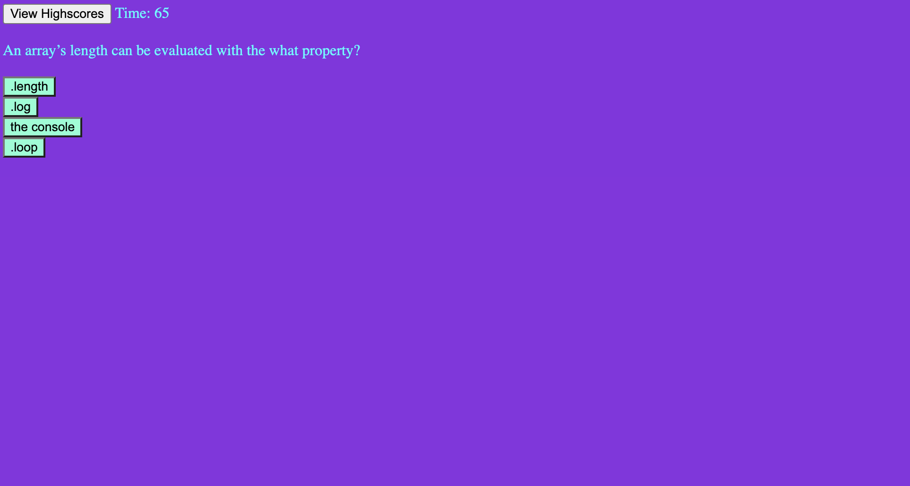
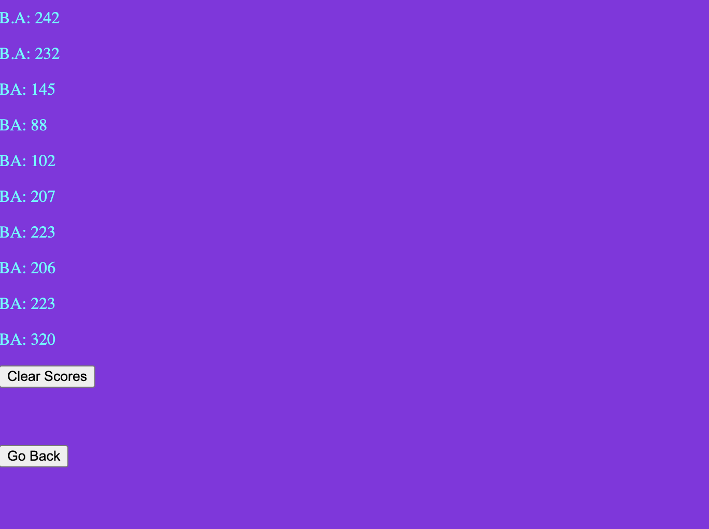

# Web-APIs-Challenge-Code-Quiz
JS-Code-Quiz
This app was developed to learn how to manipulate DOM elements using JavaScript and as an introduction to the use of the browser's local storage.

Use of the site can be summed up with the following user story:

As a a coding bootcamp student

I want to take a timed quiz on JavaScript fundamentals that stores high scores

So that I can gauge my progress compared to my peers

Up for the challenge?
When you arrive at the landing page click the "View Highscores" button to check out how well you've done in the past or "Start Quiz" to get your first question and multiple choice answers.

The timer starts When you click the "Start Quiz". Answering quickly and correctly results in a higher score. Answering incorrectly results in a time penalty and a lower score.

Click here to get started.

Technologies Used:
JavaScript
HTML
Materialize CSS
 
 Live URL: 
 [live url](https://collzbaba.github.io/Web-APIs-Challenge-Code-Quiz/)
 
 Images:
 
 
 
